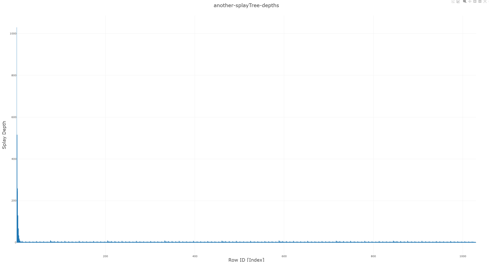

# CS2240 Project 3 - Aaron Luciano
**Trees and Depths** 
*10/16/2023*

* **Information about your data set** 
  * The data was all accumulated from my own personal playlists on spotify. They were not all one large playlist,
    but rather I had to convert the multiple CSV files into one general CSV file called "merged-playlists.csv"
    through the use of windows' built in terminal. To acquire all the CSV files, I used https://exportify.net,
    more information on the website. 
     

* **How do the depths of the random-ordered integers compare to the depths of the 
ordered integers for each tree? Why?** 
  * BSTs:
    * Binary Search Trees (BST) have a structure that is influenced by the order in which you insert elements.
    When we inserted ordered integers, it results in a skewed tree because each new value is consistently greater 
    or smaller than the last, forming a line-like structure that increases search depth. Conversely, random data 
    tends to create a more balanced tree, as the values are inserted in no particular order, leading to a tree with 
    branches on both sides, thereby reducing the overall depth of any node.
  * AVL Trees:
    * AVL Trees are self-balancing and maintain their balance through rotations upon every insertion and or deletion.
    The tree calculates the balancing factor for each node and will restructure itself through rotations accordingly.
    As a result, the tree is well-balanced with consistent depths regardless of random-ordered integers or ordered integers.
  * Splay Trees:
    * Splay trees perform a "splay" operation on every node that is accessed--that is, adding, finding, or deleting.
    Whenever a node is "splayed", it is moved to the root of the tree. So, when initially inserting integers into the
    splay tree for a case like when we insert 1-100, they will have a sort of "descending" value, due to the nature
    of splaying at every new node, however when inserting nodes of random ordering, the tree will form a more "tree"
    like structure. When searching through the nodes afterwards, the tree will optimize for access patterns, not balance.
    They do not create a specifically "balanced" look like the AVL tree would, rather a more optimized path to access
    elements that are more frequently used.

* **How do the depths of each custom-data-type tree compare to each other?** 
  * BST:
    * Due to the nature of how my songs are ordered and identified (each track was inserted using it's identifying)
    "row id"), the BST essentially became a linked list with a depth equal to the number of songs inserted.
  * AVL Tree:
    * Because the AVL Tree enforces a strict balancing rules, the order of insertion which was an issue for the BST
    is irrelevant. The tree was able to re-balance and maintain itself consistently as well as its depth(s).
    This remains true for both my custom data type (Song) as well as any list of integers.
  * Splay Tree:
    * Again, much like inserting a list of ordered integers, the Splay Tree acts the same. It prioritizes an optimized
    path to for elements that are more frequently accessed. This results in a depth which adapts based on the access 
    patterns for songs rather than being well balanced.

* **Why do the depths of the second custom-data-type Splay Tree make sense?** 
  * The CSV shows typical splay tree behavior: initial searches for each "Row ID" are deep, indicating a less-balanced 
  tree, but subsequent searches drop to zero depth because accessed nodes are splayed to the root. Over time, 
  initial search depths decrease as the tree becomes more balanced through repeated splay operations. 
  The repetition of "Row ID" 1 with a high depth shows that the tree restructures over time, 
  a characteristic of the splay tree's optimization for frequently accessed nodes.
    
* **Tree Graphs:** 
Song Depths: AVL Depths

Song Depths: BST Depths

Song Depths: Splay Tree Depths

Additional Splay Tree Depths (5000+ values)

 

* **Compare and contrast the graphs and explain the differences based on what you know about the structure and behavior 
of the trees. Justify the time complexity of searching the trees based on the results.** 
    * Comparing and Contrasting the graphs:
      *  The BST here exhibits a trend where depths increment with indices, due to the data being inserted in order, 
      resulting in a lopsided tree and thereby poor search performance with a time complexity of O(n), 
      due to the lack of self-balancing mechanisms.  --- 
      In contrast, the AVL tree demonstrated a more uniform distribution of lower depths across indices, 
      maintaining O(log n) search time complexity even when faced with sequentially ordered data, 
      thanks to frequent rebalancing rotations post-insertions or deletions.  --- 
      The Splay tree presented a unique case; the graph reflects high initial depths
      during the first searches, dramatically decreasing upon subsequent, especially sequential, searches of the 
      same elements, showing the tree's self-optimizing behavior by moving accessed nodes to the root. This was the
      same for both the Song Depths output, as well as the other example which used 5000+ values.
    * Consequently, the time complexities are direct consequences of the structural nuances of these trees: 
      BSTs potentially suffer from their non-self-balancing nature, AVL trees benefit from strict balancing rules, 
      and Splay trees optimize over time, though with less predictability in individual operations.
    * Time Complexities:
      * BST: O(n)
      * AVL: O(log n)
      * Splay Tree: O(log n)

* **Additional Sources** 
  * Shuffling the Vector Reference: https://www.geeksforgeeks.org/stdmt19937-class-in-cpp/
